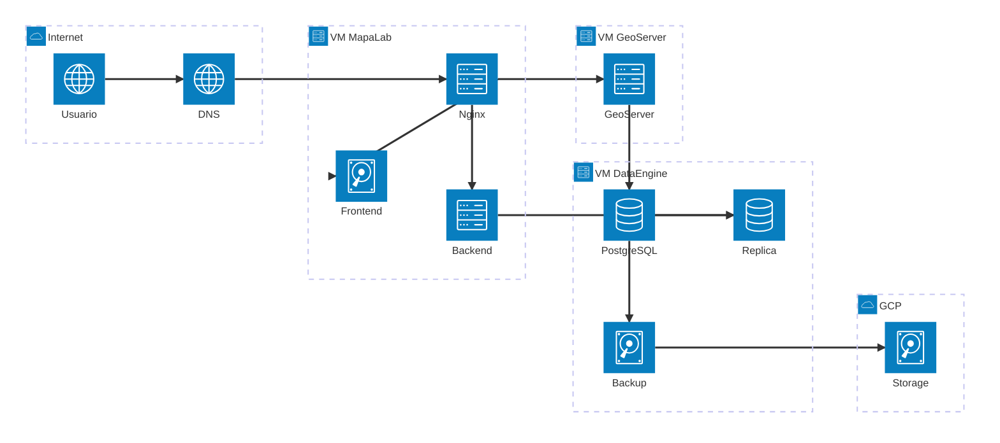
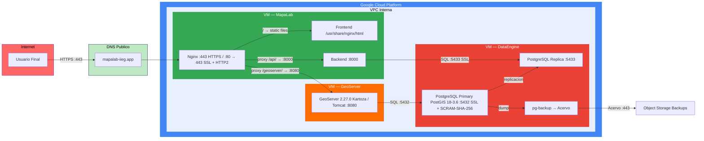
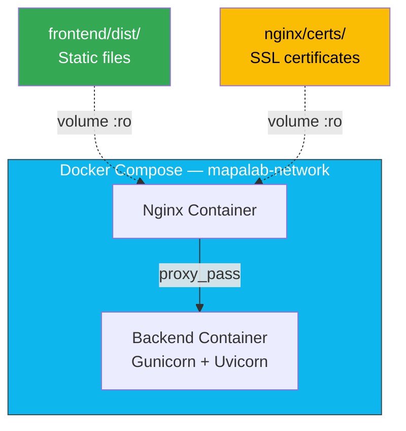

# Arquitectura

## Diagrama de infraestructura

[Diagrama de infraestructura](https://mermaid.live/edit#pako:eNqNU01v2zAM_SuGTjbQAEOPPuyQZisGpEXXbDvMLgrFZhShsSTQUrGh6H-fZH1Y6RK0PumR7z2SEv1COtkDqQnFbs81dNogLLagaSsK-zGURhVcaEABuuwO0vRV8y3gB09y3wj4zDsojD2UkV81P0dDkcsHa5Fc_hf1Ysw0q9vNG37eC-tUbOP66i7rwKefh8eBKlo6a8Cq-XVT3Fi8ptuMmtcWjIs_iX7r0FQ9GJ0W7VDa5kRf9nx8qpqvAb4v3NLuyelivaXHx8ITM_VUH820sviLax3OjKXYo0I-UPxbOu2WjlA1d3LUDGHzfR0LutxZAwR14B3NDO595CNqN6lR4YKWEziWnZiSgcyHvAa5mdCZGS3ds5NoVoRSlpJXispRS6QMQncbjyaNXa8ocKtc3xeLxediXdsV9VF7SMFpd3x4OqZE3I88t5xyP-qwAqdkaSCfDMyUnp8k_BCRnrznV_eMGZ81ySizi3-8SPAoOYTLIxeEIe9JrdHABRkAB-ogeXG6lug9DNCS2h572FFz0C1pxauVKSp-SzlEpX19tif1jh5Gi4yy6wErThnSIUXR3gPglTRCk_ry0-XrP-CujVI)

## Diagrama de flujo de red

[Diagrama de red](https://mermaid.live/edit#pako:eNqVldtum0AQhl9lRS7rA8aHIC4q-YAdK7FDjVNVratoDAumARYtS5U0idSrPkDVJ8yTdBYwsWO7UrlA7PJ__-7ODMOj4jCXKobic0g25GqxigleabYuJqbzpbmYm8svK2UaC8pjKlbK10IkrxvbXOC7mzQDHjAyDmIIKwGN3VX8xnA0t1GPd2Jl6zBw2J7d6HqGbyNIIIR1PQio34Ak-afhZGghMmHMDykZhixziRWC8BiP9qwr4KM1RADvpDgR7Mn2pbPbWd_qS_mMvPz8Q2a4sytYHxDymk-m808onftBfE-MTqdNLpZLyyZNYugqefn1m8g5274i7_I32lGbsYkeY85wb7FLmlnKm-kGOG3G0re5EVF4lBtIbgDOncRwQVU9kO2E79hRR-brQUcgwJQr0qOLWZNbazFFucVS4XNqf7giFg8i4A9ETk2mNmnp9XajR4xup62Vp7aHi_6sbl_061q3d8p4YVr7xguaYKFA7tQ-RQ0uJZX49TWGIEvycPcdyr-z_w3DxLx-jcOEMhtNKD-6biGtNERraOcNlVwCF-wHYOKXLHJAyHToJ9JxMNjZnfy4SL3-_mmlFJUki2qlPMnPpFDggxQUtbfF8kHJNfNApAJE4BAvCGkq-bF5qEw4u38gTUiCgilL6AkL66TYpyzNT14heo5gXLabGZglIjOZZ1DWghQVqS5UCLyRaaUEy2xrVYxKHS-KwglY_NZsT-dmUVIKsEQqAT6XgqJIqtBCPsSsXq-_UUcQWzAOPiWDvKzSPIllBxIP2HG2DVIGNzTOvF6vlgrO7qhxdr7WXJ3WHBYybpzJaO5wsgMWSAu0TsW0elqrfYrBVlcyHU3vejsUnLepvqU8z9ulZKcrKKp7qkcrqjQ5vlbZ-kqy3QG9235dj-r0dZdv15OdZLsiYMK7Fed0Na3lneZkGZRx9Hqu2qpA2uu2VHUHVGr4xwpcxRA8ozUlojwCOVQepeVKERsaYesy8NGlHmQh_rZW8TNiCcSfGYu2JGeZv1EMD8IUR1nigqCjALAbRNUsx2-S8iHLYqEYmqo9_wXdGB2e)

## Componentes

### VM MapaLab

| Servicio | Tecnologia | Puerto | Descripcion |
|----------|-----------|--------|-------------|
| Nginx | nginx:stable-alpine | 80, 443 | Reverse proxy, SSL termination, cache de GeoServer |
| Frontend | React 19 + Vite | — | Archivos estaticos servidos por Nginx |
| Backend | FastAPI + Gunicorn | 8000 | API REST, 4 workers Uvicorn |

### VM DataEngine

| Servicio | Tecnologia | Puerto | Descripcion |
|----------|-----------|--------|-------------|
| PostgreSQL Primary | PostgreSQL 18 + PostGIS 3.6 | 5432 | Base de datos principal, SSL + SCRAM-SHA-256 |
| PostgreSQL Replica | PostgreSQL 18 | 5433 | Replica de lectura |
| pg-backup | pg_dump | — | Backups automaticos a Object Storage |

### VM GeoServer

| Servicio | Tecnologia | Puerto | Descripcion |
|----------|-----------|--------|-------------|
| GeoServer | 2.27.0 Kartoza / Tomcat | 8080 | Servidor de mapas OGC (WMS, WFS, WCS) |

## Docker

### Servicios containerizados (VM MapaLab)

[Diagrama de servicios containerizados](https://mermaid.live/edit#pako:eNqFks9KAzEQxl8lpEdbu9gWJUgPreBFvKgXjUh2M2lDd5NlkvUPVfAhfEKfxNnsttKDmEvmm3y_j0zIlhdeAxd8hapes9uFdIxWaPKuoX2xAXyQ_CIVbOmr2gdg359frFK1KlU-chBfPG4kf-zgdrmVda-EXbc7US4q6wAPPLmiSKfJteiqX995juP5ZeNs4dGxI3b3nKo9TmbpulLbECnCILHUHrd6nPibqKItmLElBCLZ6Hg0f5f82ZdNBUygl_y9u2iXVADGQFGpNU6qD7q5SofW2ELF_8O6uCTYKNlq9K9vT7UKobX1g--MIb6V0L90e9tSDDKdn4Iehoh-A2IwOZvq2XRY-NKjGBhjDkAauMcmU3U2m_zhSwP1RpPnRbYPzLKMD-kHWM1FxAaGvAKsVCv5to2QPK6hAskFlRqMasoouXQfhNXK3Xtf7Uj0zWrNhVFlINXUmh7swir6TdW-izQ84NI3LnJxkp18_ADLUNiF)

### Servicios externos (no containerizados)

- PostgreSQL (VM DataEngine)
- GeoServer (VM GeoServer)
