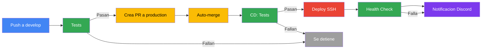
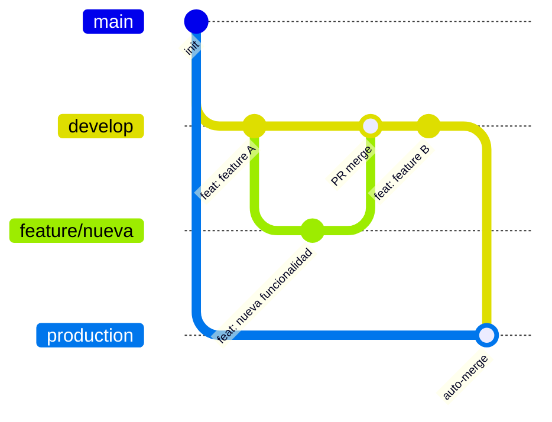

# CI/CD

Pipeline automatizado con GitHub Actions para integración continua y despliegue continuo.

## Flujo completo


[Diagrama online](https://mermaid.live/edit#pako:eNqNks1uozAUhV_Fcrck4jeAFyMlkIRFVUXNLKqBLlx8HVAdjMBUk0ny7mMo7TCLSMEb7POdc6_hnnEuGWCCDw2tC_T4nFVIP8t017UFoojBBwhZv6LZ7AdapT-hVe3rJ7Pqzy472tLqgqI0aoCi3bP21I1kXa5KWY1kNLjjdNkpOTtCc4BRiAdhnUYxQdPo9TR6k8ZQC3lC-30y6pvBt00ToEIVKCogfx-l7SAl6ZNUJS9zmus2UFy2uWyYRqatb6gQfYGXdA_6oqqECv5r4BuYRH8eXlDyldWqkwC0RLwUgjy4duBx18ilkA154JxPodUIOS4NPOcGFI0Qf3vLze8k0zSnUHwPtL6n3GaEgLqO492AtvckJSPk5w4FdgN6GaEQ-jWBsKFHsGSYqKYDA-spOdJ-i8-9PcOqgCNkmOhXBpx2QmU4q67aVtPql5THL2cju0OBCaei1buuZlRBXFI93_8QqBg0kewqhUk4JGByxr8xCfy574Zh4PquZVtm6Br4hIkVOPOF7Tnhwte_1_IW9tXAf4aa5jzwPf3dTce3PN-0Q-_6F_PhAqk)

## Workflows

### CI (`.github/workflows/ci.yml`)

- **Trigger**: Push a feature branches (excluye `develop` y `production`), PRs
- **Que hace**: Lint (ESLint) + Tests (Vitest)
- **Proposito**: Validar codigo antes de mergear a `develop`

### Commit Lint (`.github/workflows/commit-lint.yml`)

- **Trigger**: Pull requests
- **Que hace**: Valida que los commits sigan [Conventional Commits](https://www.conventionalcommits.org/)
- **Formato**: `<tipo>[(ambito)]: <descripcion>`
- **Tipos validos**: `build`, `chore`, `ci`, `docs`, `feat`, `fix`, `perf`, `refactor`, `revert`, `style`, `test`

### Auto PR (`.github/workflows/auto-merge.yml`)

- **Trigger**: Push a `develop`
- **Que hace**:
  1. Ejecuta lint + tests
  2. Si pasan, crea (o actualiza) un PR de `develop` → `production`
  3. Habilita auto-merge en el PR
- **Seguridad**: El PR pasa por las reglas de proteccion de `production` antes de mergearse

### CD (`.github/workflows/cd.yml`)

- **Trigger**: Push a `production`
- **Jobs**:

| Job | Depende de | Que hace |
|-----|-----------|----------|
| `test` | — | Lint + tests |
| `deploy` | `test` | Conecta via SSH al servidor y ejecuta `make deploy` |
| `health-check` | `deploy` | Verifica que `https://mapalab-iieg.app` responda HTTP 200 |
| `notify` | `deploy`, `health-check` | Envia notificacion a Discord (exito o fallo) |

## Branches



[Diagrama online](https://mermaid.live/edit#pako:eNp9kctuwyAQRX8FzdpNjR2TmF0fUrdVl5U3FMY2qgGLQtQ2yr-XOE6lJG1mAZrHuXMRW5BOIXDodHjyYuwbS1JIZ4wORCtOGtBWhwYOjTcvrOyJwg0ObvxjuEURONmf0SO5O-Pm-q2NuBH_0lOXtNFK7awYtBLqqCN7lO8uhlMHBn2Hp-Kz4PPLoXnBG6HtibXROxVlSBuvbbry1vuLHeeSB5uz3qwhYnA3s0XIoPNaAQ8-YgapmlymFLZ7voHQo0lje0xhK-IwfcsuYaOwr86ZI-ld7HrgrRg-UhZHJQI-atF5YX6rHq1C_-CiDcCLatIAvoVP4CWjC1bk9ZJSVtB0Z_AFnJb1gpV1ztYsLytasWKXwfe0NV-sV1WeokzMclWt6O4H49bBkA)

| Branch | Proposito | Proteccion |
|--------|-----------|------------|
| `develop` | Rama principal de desarrollo | PR requerido, commit-lint |
| `production` | Rama de produccion (deploy automatico) | PR requerido |
| `feature/*` | Ramas de features | — |

## Deploy

El job `deploy` del CD se conecta via SSH al servidor GCP y ejecuta:

```bash
cd $PROJECT_PATH
git fetch origin production
git checkout production
git pull origin production
make deploy
docker image prune -f --filter "until=168h"
```

### `make deploy`

1. Crea la red `iieg-network` si no existe (`ensure-networks`)
2. Construye el frontend en Docker (Node 24 Alpine) con `--profile build`
3. Levanta backend + nginx con `--profile staging`, `--force-recreate` y `--env-file .env.production`

## Health Check

Despues del deploy, se verifica que la app responda:

- **URL**: `https://mapalab-iieg.app`
- **Esperado**: HTTP 200
- **Reintentos**: 10 intentos, cada 15 segundos (~2.5 minutos)
- Si falla, el deploy se marca como fallido y se notifica a Discord

## Notificaciones Discord

Se envia un embed a Discord segun el resultado:

- **Exito** (verde): Commit, autor, cambios, health check passed, link al workflow
- **Fallo** (rojo): Commit, autor, que paso fallo (Deploy SSH o Health Check), link a los logs

Las notificaciones usan `continue-on-error: true`, por lo que si Discord no responde, el pipeline no se ve afectado.

## Secrets

Configurados en **Settings → Environments → production → Environment secrets**:

| Secret | Descripcion | Ejemplo |
|--------|-------------|---------|
| `SSH_HOST` | IP o dominio del servidor GCP | `34.x.x.x` |
| `SSH_USER` | Usuario SSH del servidor | `egar.guapo` |
| `SSH_PRIVATE_KEY` | Llave privada SSH (ed25519) | Contenido de `~/.ssh/github_actions` |
| `SSH_PORT` | Puerto SSH | `22` |
| `PROJECT_PATH` | Ruta absoluta del proyecto en el servidor | `/home/egar.guapo/mapalab` |
| `DISCORD_WEBHOOK_URL` | URL del webhook de Discord | `https://discord.com/api/webhooks/...` |

## Configuracion del repositorio

### Permisos de Actions

En **Settings → Actions → General**:

- Workflow permissions: **Read and write permissions**
- Allow GitHub Actions to create and approve pull requests: **Activado**

### Rulesets

**Ruleset `develop`:**
- Require PR antes de merge
- Required status checks: `commit-lint`

**Ruleset `production`:**
- Require PR antes de merge
- Block force pushes

### Auto-merge

En **Settings → General → Pull Requests**:

- Allow auto-merge: **Activado**

## Troubleshooting

### El auto-merge no se ejecuta

- Verificar que auto-merge este habilitado en Settings → General → Pull Requests
- Verificar que el workflow tenga permisos `contents: write` y `pull-requests: write`
- Los PRs creados por `GITHUB_TOKEN` no disparan otros workflows (es por diseño de GitHub)

### Deploy falla con "ssh: no key found"

- La llave privada en `SSH_PRIVATE_KEY` debe estar completa (desde `-----BEGIN` hasta `-----END OPENSSH PRIVATE KEY-----`)
- Verificar que no tenga espacios extra (descargar el archivo en vez de copiar desde la consola web)

### Health check falla

- Verificar que `https://mapalab-iieg.app` sea accesible desde internet
- Revisar logs de nginx en el servidor: `make logs-nginx`
- Verificar certificados SSL: `ls -la nginx/certs/`

### Nginx no encuentra certificados SSL

- `make deploy` detecta SSL via `SSL_MODE=true` en `nginx/.env`
- Los certificados deben existir en la ruta definida por `SSL_VOLUME_PATH` en `nginx/.env`
- Para regenerar: `make ssl`
