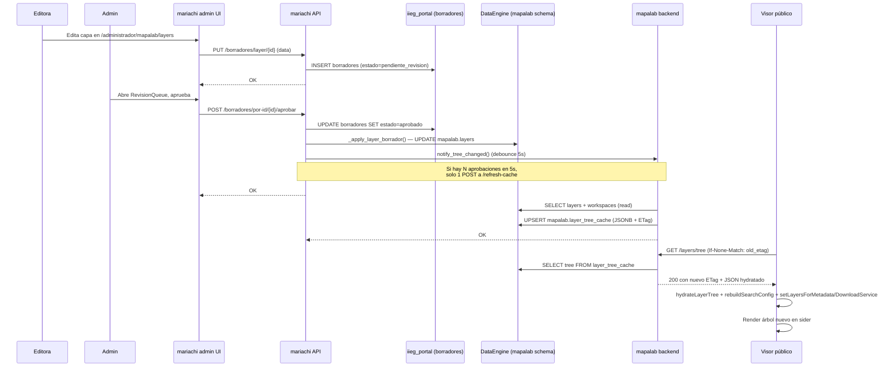

# Sistema de capas

Arquitectura de v1.4.0+. Las definiciones de capas se obtienen del backend en tiempo de ejecución; no existen archivos JS con capas hardcodeadas.

## Distribución de responsabilidades

| Componente | Rol |
|---|---|
| **DataEngine** (`dataengine`) | Fuente de verdad. Schema `mapalab` con `layers`, `workspaces`, `initial_layer_order`, `layer_tree_cache`, `layer_metadata`, `layer_stats` |
| **mariachi** (`mariachi/api` + `mariachi/admin`) | CRUD + editor UI. Rol `mariachi_layers` es owner del schema. `/administrador/mapalab/layers` es la interfaz de edición |
| **mapalab/backend** | Lectura pública via `GET /layers/*` + `GET /metadata/*`. Sin escritura |
| **mapalab/frontend** | Consume endpoints y renderiza |
| **dataengine-jobs** container | Cron diario: `refresh_periodicity` (03:00), `refresh_layer_tree` (04:00), `refresh_layer_stats` (04:30) |

## Schema en DataEngine

### `mapalab.layers`

Árbol jerárquico con self-referencia (`parent_id`). Cada fila es un nodo con `node_type`:

| node_type | Significado |
|---|---|
| `tema` | Raíz (General, Seguridad, ...) |
| `category` | Carpeta expandible (ex `isCategory: true`) |
| `label` | Encabezado sin toggle (ex `isLabel: true`) |
| `group` | Agrupa hijos como unidad (ex `forceGroup: true`) |
| `leaf` | Capa con `wmsConfig` real |

Columnas: identidad (id, parent_id, label, sort_order), visibilidad (hidden_in_menu, disabled), WMS (workspace_alias, geoserver_layer, styles, cql_filter, wms_group), descarga (wfs_available, wfs_layer_name, downloadable), metadata (metadata_layer), temporal (default_date, time_enabled, time_style_pattern, raster_periodicity, hide_periodicity), vista (default_zoom, zoom_range), búsqueda (search_tags, searchable_fields, has_municipio, has_direccion, municipio_field, direccion_field), infobox (infobox_template, infobox_params, infobox_config), auditoría (created_at, updated_at, updated_by).

### `mapalab.workspaces`

Mapeo de alias → workspace GeoServer → schema PostgreSQL. 11 workspaces:

| alias | geoserver_workspace | db_schema |
|---|---|---|
| general | general | mapa_base |
| economia | economia | economia |
| salud | salud | salud |
| educacion | educacion | educacion |
| seguridad | seguridad_y_proteccion_ciudadana | seguridad_y_proteccion_ciudadana |
| recursos | recursos_y_calidad_de_vida | recursos_y_calidad_de_vida |
| demografia | demografia | demografia |
| desarrollo | desarrollo_social | desarrollo_social |
| gobierno | gobierno_y_ciudadania | gobierno_y_ciudadania |
| raster | raster | raster |
| mundial | mundial | mundial |

### `mapalab.initial_layer_order`

Capas activas al cargar el visor. 6 entradas por default (`limite_iieg`, `regiones`, `limite_municipal`, `cabeceras_municipales`, `cuerpos_de_agua_50k`, `curvas_de_nivel`).

### `mapalab.layer_tree_cache`

Fila singleton (`id=1`) con `tree` (JSONB), `initial_order` (JSONB), `workspaces` (JSONB), `etag`, `source_max_updated_at`, `layer_count`. Se regenera:
- 04:00 AM diario (cron en `dataengine-jobs`)
- Manualmente: `make refresh-layer-tree`
- Automáticamente al editar capas en mariachi via `notify_tree_changed()` → `POST /mapalab/api/layers/refresh-cache`

### `mapalab.layer_metadata`

Descripción, fuentes (JSONB), metodología (JSONB), metadato (JSONB con links TXT/XLSX en Acervo), frecuencia, fecha_ultima, tipo_mapa, texto_leyenda, tarjeta_punto_poligono, link_final_capa, downloadable, auditoría. Editable desde mariachi.

### `mapalab.layer_stats`

`stats_config` (JSONB con queries SQL, whitelist SELECT-only), `values` (JSONB con numeralia calculada), `pie_numeralia`, `values_refreshed_at`, `ttl_minutes`. El cron `run_refresh_layer_stats.py` ejecuta las queries y popula `values` diariamente.

## Endpoints

### mapalab backend (lectura pública, sin auth)

| Método | Ruta | Función |
|---|---|---|
| GET | `/layers/tree` | Árbol completo con `ETag: W/"..."` (304 si coincide `If-None-Match`). Sirve de `layer_tree_cache` |
| GET | `/layers/initial-order` | `["limite_iieg", ...]` |
| GET | `/layers/workspaces` | Lista con alias + geoserver_workspace + db_schema |
| GET | `/layers/search?q=X&limit=N` | Búsqueda flat en label/tags/id con `path` |
| GET | `/metadata/?workspace=X&layer=Y` | Descripción + numeralia. Lee solo de `layer_metadata` + `layer_stats` (sin fallback legacy desde v1.7.0) |
| GET | `/metadata/sources?layers=w:l,w:l` | Fuentes por lotes |
| POST | `/layers/refresh-cache` | Reconstruye `layer_tree_cache` (trigger interno, usado por mariachi) |
| POST | `/layers/invalidate-cache` | Solo invalida caché en memoria del proceso (sin tocar DB) |

### mariachi api (CRUD + auth)

Prefijo `/api/administrador/`:

| Método | Ruta | Función |
|---|---|---|
| GET | `/layers/workspaces` | Lista workspaces editables |
| GET | `/layers/{id}` | Obtener capa |
| POST | `/layers` | Crear capa (admin + CSRF) |
| PUT | `/layers/{id}` | Editar |
| DELETE | `/layers/{id}` | Eliminar |
| PATCH | `/layers/reorder` | Reordenar hijos de un padre (drag&drop del árbol, admin-only) |
| PATCH | `/layers/initial-order` | Actualizar capas iniciales |
| PATCH | `/layers/bulk-tags` | Edición masiva de tags (máx 500 por request, paste-from-Excel) |
| POST | `/layers/{id}/duplicate` | Duplicar |
| GET/PUT | `/layer-metadata/{layer_key}` | Metadata descriptiva |
| GET/PUT | `/layer-metadata/{layer_key}/stats` | stats_config + values |
| GET | `/geoserver/workspaces` | Lista workspaces + capas disponibles en GeoServer |
| GET | `/geoserver/workspaces/{alias}/layers/{layer}/fields` | Campos via WFS DescribeFeatureType |
| GET | `/geoserver/workspaces/{alias}/layers/{layer}/styles` | Estilos disponibles |
| POST | `/borradores/por-id/{id}/aprobar` | Aprueba borrador; si `resource_type='layer'` materializa |

Todos los writes invocan `notify_tree_changed()` → invalida `layer_tree_cache` del backend mapalab.

Rate limiting: writes a 60 req/min por usuario, reads de GeoServer a 120 req/min. Responde `429` con `Retry-After`.

## Frontend (mapalab)

### Flujo de carga

```
<LayersProvider>       # fetch /layers/tree + /layers/initial-order, HIDRATA wmsConfig, spinner
  <MapsProvider>       # consume LayersContext via useLayers(), expone allLayers en MapsContext
    <Maps />
      <consumidores>   # leen allLayers del MapsContext o layers del useLayers()
```

Si el fetch falla, `LayersProvider` muestra pantalla de error con botón recargar.

### Hidratación de wmsConfig

El backend devuelve `wmsConfig` con campos estructurales (`workspace`, `geoserverWorkspace`, `geoserverLayer`, `styles`, `cqlFilter`, etc.) pero **sin** la URL pública del GeoServer ni el `layerName` completo. Esto es intencional: el backend no debe conocer la URL pública del cliente (si cambia el dominio no hay que redeployar).

El frontend hidrata en `LayersProvider` justo después del fetch:

```js
import { hydrateLayerTree } from '@pages/maps/helpers/wmsConfig';

const hydrated = hydrateLayerTree(tree);
// Cada wmsConfig ahora tiene:
//   baseUrl: `${VITE_GEOSERVER_URL}${geoserverWorkspace}/wms`
//   layerName: `${geoserverWorkspace}:${geoserverLayer}`
//   format, transparent, version, srs (constantes WMS)
```

Los consumidores (`useWMSLayerFactory`, `useWMSLayerManager`, `useWMSLegend`, etc.) siguen leyendo `wmsConfig.baseUrl` y `wmsConfig.layerName` sin saber que se calculan en cliente.

### Acceso desde componentes/hooks

```jsx
import { useLayers } from '@hooks/useLayers';

const MyComponent = () => {
    const { layers, initialOrder, loading, error } = useLayers();
    // ...
};
```

Desde el MapsContext (cuando ya se consume):

```jsx
const { allLayers, activeLayerIds, ... } = useMapsContext();
```

### Funciones puras

Los helpers que no son componentes (ej. `downloadFeaturesAsCSV`, `findLayerById`) reciben `allLayers` como parámetro explícito desde el caller.

El servicio `layerMetadataService` usa un setter module-level (`setLayersForMetadataService`) llamado por `LayersProvider` al cargar, evitando cambiar la firma de sus exports.

## Editor (mariachi admin)

Accesible en `/administrador/mapalab/layers`. Árbol con Ant Design Tree + iconos por `node_type`, tags de workspace, badges (oculto, disabled).

**Drag & drop** (admin-only): arrastrar capas entre hermanos del mismo padre dispara `PATCH /layers/reorder` y recarga el árbol. No permite cambiar de padre.

**Drawer de edición** con formulario por secciones:
- Identidad (label, node_type, tags de búsqueda)
- Visibilidad (hidden_in_menu, disabled)
- WMS: `workspaceAlias` + `geoserverLayer` se eligen desde listas pobladas vía `/geoserver/workspaces`; `styles` autocompleta desde `/geoserver/workspaces/{alias}/layers/{layer}/styles`
- Descarga (wfs_available, downloadable)
- InfoBox:
    - Select del template (`municipio` / `punto` / `punto_municipio` / `punto_ubicacion` / `punto_completo` / `custom`)
    - Formulario dinámico con campos específicos del preset (componente `InfoBoxPresetForm`)
    - Editor JSON libre para `custom` (componente `InfoBoxJsonEditor`)
    - Preview con datos dummy del InfoBox resultante (componente `InfoBoxPreview`)

**Edición masiva de tags**: botón "Bulk tags" (admin-only) abre drawer con textarea que acepta paste TSV desde Excel/Sheets (columna `layer_id` + columna `tag1, tag2, tag3`). Preview en tabla antes de aplicar, reporta `not_found` por capa inexistente. Máx 500 filas por request.

## Observabilidad

Ambos backends exponen `/metrics` en formato Prometheus plain text. Consumido por `huachicol` (stack IIEG de Prometheus + Grafana + Loki + AlertManager) vía `MAPALAB_BACKEND_TARGET` y `MARIACHI_BACKEND_TARGET` en el `.env` del stack.

Contadores expuestos:

**mariachi** (`mariachi:8000/metrics`):
- `mariachi_rate_limit_hits_total`
- `mariachi_tree_notify_total`
- `mariachi_geoserver_calls_total`

**mapalab backend** (`mapalab-backend:8000/metrics`):
- `mapalab_tree_requests_total`
- `mapalab_tree_cache_hits_total`
- `mapalab_tree_refresh_total`
- `mapalab_search_requests_total`
- `mapalab_download_requests_total`

## Flujo end-to-end

### Secuencia de aprobación de borrador (editora → admin → visor público)



### Secuencia corta (admin edita directo sin borrador)

1. Admin edita capa → `PUT /api/administrador/layers/{id}`
2. mariachi `UPDATE mapalab.layers` + `notify_tree_changed()` (debounced)
3. mapalab backend reconstruye `mapalab.layer_tree_cache`
4. Próximo `GET /layers/tree` devuelve nuevo ETag
5. Frontend compara ETag, si difiere refetch; si no, 304
6. Consumidores (`useLayers`, `MapsContext.allLayers`) ven el nuevo árbol

## Bootstrap en producción

Primer deploy a prod de DataEngine requiere correr el script de bootstrap:

```bash
cd /IIEG/dataengine
make prod-migration           # pull final del Sheet + bootstrap + seed + migrate + stamp
# o sin ETL (si ya corriste el Sheet hoy o estas en dev sin credenciales):
make prod-migration PROD_MIGRATION_FLAGS="--skip-etl"
```

Pasos idempotentes:
1. Crear rol `mariachi_layers` con password aleatoria
2. Crear schema `mapalab` con owner correcto
3. Aplicar `jobs/bootstrap/v14_schema.sql` (6 tablas + seed workspaces)
4. Seed de capas desde JSON
5. Migrar `public.mapalab_card` → `mapalab.layer_metadata` + `mapalab.layer_stats`

El JSON se genera una sola vez desde el backend actual:

```bash
curl http://localhost:8000/layers/tree > tree.json
curl http://localhost:8000/layers/initial-order > order.json
# combinar en un JSON con shape { "layers": [...], "initial_order": [...] }
```

## Trigger manual de refresh

| Comando | Ubicación |
|---|---|
| `make refresh-layer-tree` | mapalab o dataengine |
| `make refresh-layer-stats` | dataengine |
| `make refresh-periodicity` | dataengine |
| `make refresh-all` | dataengine (los tres) |
| `make logs-jobs` | dataengine (tail del cron log) |

## Deprecaciones

- `definitions/*.js` (9 archivos): **eliminados** en v1.4.0
- `createLayerFactory`, `rasterHelpers.js`: **eliminados**
- `public.mapalab_card`: **queda como fallback legacy**; la edición se hace en mariachi
- ETL de Google Sheet (`run_bootstrap.py` en `dataengine-jobs`): **deprecated**, requiere `FORCE_LEGACY_ETL=1` para correr
- `WORKSPACE_SCHEMA_MAP` en `backend/app/consts/workspaces.py`: **legacy**, la fuente de verdad es `mapalab.workspaces`
