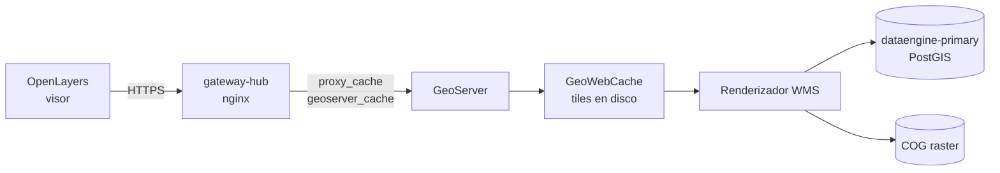

# Render de capas — cadena completa y decisiones

Contexto operativo de cómo se renderizan las capas del visor: quién sirve cada
petición, dónde está cada caché y por qué las capas están configuradas como
están. Complementa [`runbook-layers.md`](runbook-layers.md), que cubre la
recuperación del stack de datos.

Última revisión: 2026-07-23.

## La cadena



Hay **tres cachés en serie**. Al diagnosticar lentitud hay que saber cuál
respondió:

| Capa | Cómo se identifica en la respuesta |
|---|---|
| nginx del gateway | `X-Cache-Status: HIT / MISS` |
| GeoWebCache | `geowebcache-cache-result: HIT / MISS` |
| Sin caché | ninguno de los dos headers |

Un `geowebcache-cache-result: MISS` repetido para la misma URL suele significar
que nginx está sirviendo su copia de la primera respuesta (que traía MISS), no
que GWC no cachee. Para medir GWC hay que saltarse el gateway:

```bash
docker exec geoserver sh -c "curl -s -o /dev/null -D - 'http://localhost:8080/geoserver/general/wms?...'" | grep -i geowebcache
```

## Cómo llega una capa a servirse por tiles

`mapalab.layers.tiled` decide el tipo de source en el visor
(`useWMSLayerFactory`): `true` → `TileWMS` (~70 peticiones por pantalla),
`false` → `ImageWMS` (1 petición por render).

GeoServer tiene **Direct WMS Integration** activo
(`directWMSIntegrationEnabled=true`, `requireTiledParameter=true`), así que un
GetMap normal con `TILED=true` se sirve desde GWC sin cambiar de endpoint. Por
eso marcar una capa como `tiled` en el panel basta para que empiece a cachearse:
no hace falta migrarla a WMTS ni conocer su bbox.

**Requisito**: la capa no debe llevar `CQL_FILTER`. Verificado: la misma capa
(`uso_de_suelo_serie_7`) da `HIT` sin CQL y `MISS` siempre con él, porque GWC no
cachea parámetros que no estén declarados como `parameterFilter`. Las 8 capas
`economia:cultivos` usan CQL y por eso no se benefician del caché.

## Estado de las capas

| Capa | Sirve por | Notas |
|---|---|---|
| `raster:hillshade_iieg_cog` / `_inegi_cog` | WMTS nativo | basemap de relieve, ver abajo |
| `general:curvas_de_nivel_render` | WMS + GWC | tabla subdividida, ver abajo |
| `general:cuerpos_de_agua_50k` | WMS + GWC | `tiled=true`, sin CQL |
| `economia:cultivos` (×8) | WMS directo | `CQL_FILTER` por cultivo, no cacheable |

### Relieve por WMTS

`basemaps.js` pide el relieve a `/geoserver/gwc/service/wmts` con el gridset
`EPSG:900913` (31 niveles, tiles de 256 px), compatible con la vista del mapa en
`EPSG:3857`. Usa metatiling 4×4: un render produce 16 tiles.

**Cada capa lleva su propio `extent`**, tomado del `WGS84BoundingBox` que publica
GWC. No es opcional: WMTS responde **400 `TileOutOfRange`** a cualquier tile
fuera del área de la capa, y sin `extent` el tileGrid de OpenLayers cubre el
mundo entero y pide tiles inexistentes. El WMS no tiene ese problema (devuelve
PNG transparente), así que es un riesgo exclusivo de WMTS.

Si se regenera alguno de los dos rasters con otra extensión, hay que actualizar
`bounds` en `basemaps.js`. El test `basemaps.test.js` fija el rango esperado de
tiles a z=8 y falla si el grid se desalinea.

### Curvas de nivel: tabla de render

`mapa_base.curvas_de_nivel` guarda cada curva como un LineString completo:
mediana de 133 vértices, pero **47 features superan los 100 000** y la mayor
llega a **910 621**. Esas geometrías cruzan medio estado, así que el índice GiST
las selecciona en casi cualquier tile: un tile de 256 px procesaba **13.2
millones de vértices sin importar el zoom**.

La migración `0026_curvas_de_nivel_render` (dataengine) materializa
`mapa_base.curvas_de_nivel_render` con `ST_Subdivide(…, 512)` y ya reproyectada a
3857. Medido:

| zoom | antes | después |
|---|---|---|
| z=11 | 624.8 ms/tile | **20.6 ms** |
| z=13 | 764.4 ms/tile | **7.3 ms** |
| z=15 | 1165.3 ms/tile | **5.0 ms** |

La tabla original **no se toca**: conserva las curvas completas en 6368 y es la
que apunta `wfs_layer_name`. Si se recargan las curvas, hay que regenerar la
tabla de render (`make migrate` no la reconstruye si ya existe: la migración
hace `DROP TABLE IF EXISTS` solo al aplicarse por primera vez).

Ambos featuretypes tienen **WFS deshabilitado** (`disabledServices`), la original
desde 2026-02-25 — descargar 35M de vértices tumbaría el servidor.

> Pendiente conocido: `mapalab.layers` marca `downloadable=true` y
> `wfs_available=true` para `curvas_de_nivel`, y no hay CSV pre-generado en
> `mapalab.layer_downloads`. El visor ofrece una descarga que no funciona.

## La reproyección no es el cuello de botella

Todas las capas se declaran en `EPSG:6368` y el visor pide `EPSG:3857`, así que
GeoServer reproyecta en cada render. Medido, el costo es menor de lo que parece:

| Capa | nativo 6368 | reproyectado 3857 |
|---|---|---|
| `curvas_de_nivel` | 545 ms | 614 ms (+12 %) |
| `cuerpos_de_agua_50k` | 13.7 ms | 47.9 ms |
| `hillshade` (raster) | 104 ms | **79.5 ms** (más rápido) |

El raster sale más rápido reproyectado porque aprovecha mejor los overviews del
COG. Antes de invertir en eliminar reproyecciones, conviene medir: el costo
dominante suele ser la densidad geométrica, no la transformación de coordenadas.

Precedente relacionado: la migración `0022_cultivos_geom_3857` materializó una
columna `geom_3857` en `economia.cultivos` por esta misma razón.

## Indicador de carga

Con `ImageWMS` el spinner recibía un `start` y un `end` por render. Con tiles
recibía uno por **cada** tile (~70 por pantalla), de ahí el parpadeo.

`useWMSLayerFactory` ahora cuenta tiles en vuelo: emite `start` con el primero y
`end` solo cuando no quedan pendientes **y** pasan 250 ms sin actividad nueva. El
margen importa porque OpenLayers carga en tandas y el contador toca 0 entre
ellas; sin él, el spinner vuelve a parpadear. Cubierto por
`useWMSLayerFactory.test.js`.

## Trampas conocidas

**Rate limit de GeoServer.** `controlflow.properties` tiene
`user.ows.wms.getmap`, un límite por segundo que responde **429**. Se cuenta por
cookie `GS_FLOW_CONTROL`, así que `curl` sin cookie **no lo reproduce** aunque
supere el límite; hay que mandar la cookie para verlo. Estaba en `120/s`,
pensado para el modelo de imagen única (1 petición por render); con tiles de
256 px una sola pantalla son ~70 peticiones. Subido a `600/s`
(`GS_CONTROLFLOW_USER_WMS_GETMAP` en `/IIEG/geoserver/.env`, que está
gitignoreado).

**Caché del gateway.** Antes solo `/geoserver/ows` tenía `proxy_cache`, y nadie
usa ese endpoint: el tráfico real va a `/geoserver/{workspace}/wms`, que caía al
bloque padre sin caché. En 24 h fueron 11 560 peticiones con **86.6 % de URLs
repetidas** y cero cacheadas. La location dedicada está en
`gateway-hub/nginx/includes/geoserver-locations.inc`. Ese include va **dentro de
la imagen**, no montado: tras editarlo hay que `docker compose build nginx`, o el
cambio se pierde al recrear el contenedor.

**ETag del árbol de capas.** `layer_tree_cache.etag` se calcula como
`md5(max(updated_at) | count)`. Un `UPDATE` por SQL directo sobre
`mapalab.layers` no toca `updated_at` y deja el árbol servido con el etag viejo:
hay que actualizar `updated_at` a mano y correr `make refresh-layer-tree`.

Una consecuencia peor apareció con timestamps en el futuro: bastaba **una** capa
con `updated_at` adelantado para congelar el etag hasta que pasara esa hora, y
los cambios del panel no llegaban al visor. Causa: `app/core/time.py:utcnow()`
devuelve un datetime **naive** que representa UTC, y el engine de DataEngine se
conectaba sin fijar timezone contra un servidor con `America/Mexico_City`, así
que Postgres lo interpretaba como hora local y le sumaba 6 h. Corregido fijando
`options: -c timezone=utc` en `connect_args` del engine de DataEngine
(`mariachi/api/app/core/database.py`).

No confundir con un reloj desincronizado: se verificó que host y contenedores
coinciden al segundo con NTP activo. La diferencia era de interpretación, no de
reloj — `mariachi-postgres` corre en `UTC` y `dataengine-primary` en
`America/Mexico_City`.

## Verificaciones rápidas

```bash
# ¿la capa se sirve desde GWC?
docker exec geoserver sh -c "curl -s -o /dev/null -D - \
  'http://localhost:8080/geoserver/general/wms?REQUEST=GetMap&SERVICE=WMS&VERSION=1.1.0\
&FORMAT=image%2Fpng&STYLES=&TRANSPARENT=true&LAYERS=general%3Acurvas_de_nivel_render\
&TILED=true&WIDTH=256&HEIGHT=256&SRS=EPSG%3A3857&BBOX=-11549572,2374187,-11541572,2382187'" \
  | grep -i geowebcache

# ¿hay capas con timestamp en el futuro? (congelan el etag del arbol)
docker exec dataengine-primary sh -c 'PGPASSWORD=$POSTGRES_PASSWORD psql -U $POSTGRES_USER \
  -d $POSTGRES_DB -Atc "select count(*) from mapalab.layers where deleted_at is null and updated_at > now()"'

# geometrias que un tile obliga a procesar (sustituir el envelope por el tile a medir)
docker exec dataengine-primary sh -c 'PGPASSWORD=$POSTGRES_PASSWORD psql -U $POSTGRES_USER -d iieg_gis -Atc \
  "select count(*), sum(ST_NPoints(geom)) from mapa_base.curvas_de_nivel_render \
   where geom && ST_MakeEnvelope(-11549572,2374187,-11541572,2382187,3857)"'

# 429 de control-flow: solo se reproduce con la cookie
curl -sk -b "GS_FLOW_CONTROL=x" -o /dev/null -w "%{http_code}\n" "https://<host>/geoserver/raster/wms?..."
```
