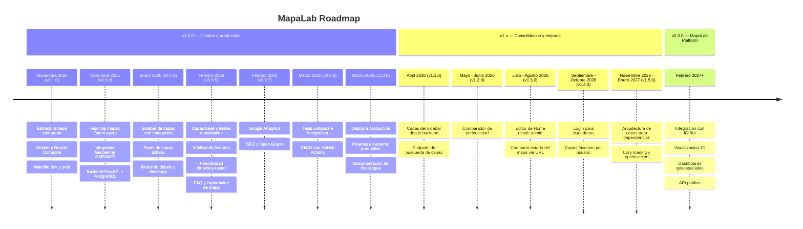

# Roadmap

## Timeline

[Diagrama de timeline online](https://mermaid.live/edit#pako:eNp9Vdty4kYQ_ZUuPWVrbRawDTFvGGzWWyZml022KsVLo2nkyUrT2rlQxi5X5SPyhfmStCQMBMk7xcOIOTN9-kz3mecoZkXRIPI6o1QbWhiQ4bVPCaaY4x0u4QujyjCvlhzFXrOBdafVbrXh37__gRFm2jAg5JZViGNZrrDF-I3XmrKlJei2uxfwy7rdkp3v9oBiDODaeRtiHyzCEh1BxoYt5XyMG3P8nSxsXicjznJ2dAyb4ndaaclB0VrABbE9ZKzjY0oXDZT-0I6tHACSOzq4z8nc4YasOwbeGk-JxSJvmBDPya6F2bfp_MO3m_kx-AqFt1Fwg84PZ7fwHmbsfGJp_vluj702ZLmg1yvp9RvozbWiJZYE45JgLOFjFCpsNdZIztBQugej3OK6jpqywhKlyGMq-m1k5mK0Ce6hNyTaHdK7bF3U6I3KMOVdbiDVmfbkIAtGtM8xpQYRV3zFj0XsFaEUQh0yI6tZyQEKFShtpOxiBCtCkj3G3gw_S1x6zNn66ma2F_nTNPq1NCbMicgwNJhuvI5rnObX9xKnqA2YWMwf9utTtE__O_yydvhXct6BaOJRMnNAoPelVBP09sNoXF7yRPuPYQnDshHdGxHL9qxFHFOe8uaNVt2qbIPUlZAx8vNspbMrsBRMUzuGTGA7iaVa8lRTEqhmF4-VWQhlTuUKyx0byOgvtoeFOFxane6zaDKLqraU1LPbNYGT4Muqt2reYlTOomzBbxncj0AKd51wKN-G4RQ-yX0cqNhtii-mgxZVZQ_5QVnukZ9Cqovjhom098F5Z03mp7SvzvrIGW2TEc_Vpjmy1xakdIRAKUJR1rDWCL9_ObCQOeV-a3OncC_WujW8isZ5A407TrSBIjOIdZBs0LBr1n6Fa3EZLzNpMAguFAX8hun3JP7Oz_pl9Ca7HdofQUyiegN2PlWyUST9pcjEDb52h0_iL_JCaZNIObEknemngw7aVWB392C9PmyzFP2KbdboCf33P_P5og9vJ7dX7BuejYDplgKcjWstg-5hyWiVg4RY2kWATYZYPA55WKbicdFJlFitooG8kXQSZWQzLD6j52LTIvIPlNEiGshU0QpD6hfRwrzIthzNn8zZ607LIXmIBitMnXyFXMlzMdYoSWW7f20htR1xMD4aiA7lIdHgOXqMBqfnrU73rHt-3r3o9i57nV6_T6f9k2gjSyJuMfqdbrv3a-dcBDy77Jz1X06ip5KBCWn68h_f-GrN)

## Camino a MapaLab Platform

### v0.1.0 — Noviembre 2025
- [x] Estructura base del proyecto (monorepo con frontend, backend, nginx)
- [x] Configuracion de Docker y Docker Compose (desarrollo y produccion)
- [x] Makefile con comandos para dev y prod

### v0.5.0 — Diciembre 2025
- [x] Visor de mapas con OpenLayers
- [x] Integracion con GeoServer (WMS/WFS)
- [x] Backend FastAPI con conexion a PostgreSQL

### v0.7.0 — Enero 2026
- [x] Sidebar de capas con categorias y subcategorias
- [x] Panel de capas activas con controles de visibilidad
- [x] Modal de detalle de capa con metadatos y descarga

### v0.9.5 — Febrero 2026
- [x] Capas base y limites municipales configurables
- [x] InfoBox con informacion de features al hacer clic
- [x] Periodicidad dinamica en capas raster
- [x] Seccion de preguntas frecuentes
- [x] Exportacion del mapa visible (JPG, PNG, PDF)

### v0.9.7 — Febrero 2026
- [x] Google Analytics (integracion y eventos clave)
- [x] SEO (metatags, Open Graph, sitemap.xml, heading structure)

### v0.9.9 — Marzo 2026
- [ ] Creacion de tests unitarios y de integracion
- [x] CI/CD con GitHub Actions (lint, build, deploy automatico)

### v1.0.0 — Marzo 2026
- [x] Deploy a produccion (servidor IIEG)
- [ ] Pruebas finales en entorno productivo
- [x] Documentacion de despliegue

---

## v1.x — Consolidacion y mejoras

### v1.1.0 — Abril 2026
- [ ] Migrar lista de capas del sidebar a endpoint del backend
- [ ] Endpoint de busqueda de capas desde backend

### v1.2.0 — Mayo / Junio 2026
- [ ] Herramienta para comparar periodicidad de mapas (vista lado a lado)

### v1.3.0 — Julio / Agosto 2026
- [ ] Modo edicion de Home integrado al administrador de portal
- [ ] Compartir estado del mapa via URL (para el componente comparar, ademas de agregar orden de capas, opacidad, etc)

### v1.4.0 — Septiembre / Octubre 2026
- [ ] Sistema de login para ciudadanos
- [ ] Guardar compartidos
- [ ] Sistema de capas favoritas por usuario

### v1.5.0 — Noviembre 2026 / Enero 2027
- [ ] Arquitectura de capas para agilizar integracion de otras dependencias
- [ ] Optimizacion de carga inicial y lazy loading de componentes

---

## v2.0.0 — MapaLab Platform (Febrero 2027+)

- [ ] Integracion con IGIBot (AgencIA)
- [ ] Visualizacion 3D de terreno y datos volumetricos
- [ ] Generador de dashboards personalizados con indicadores geoespaciales
- [ ] API publica documentada para consumo externo de datos
- [ ] Analisis espacial interactivo (buffers, intersecciones, estadisticas por zona)
- [ ] Modo colaborativo en tiempo real para edicion de mapas tematicos
- [ ] Importacion de datos externos (Shapefile, GeoJSON, KML, CSV)
- [ ] Embebido de mapas en sitios externos (iframe / widget)
- [ ] Sistema de roles y permisos (administrador, editor, visualizador)
- [ ] PWA con soporte offline para consulta en campo
- [ ] Sistema de notificaciones (nuevas capas, actualizaciones de datos)
- [ ] Generacion automatizada de reportes geoespaciales
