# Roadmap

## Timeline

```mermaid
timeline
    title MapaLab Roadmap
    section v1.0.0 — Camino a produccion
        Noviembre 2025 (v0.1.0)
            : Estructura base monorepo
            : Docker y Docker Compose
            : Makefile dev y prod
        Diciembre 2025 (v0.5.0)
            : Visor de mapas OpenLayers
            : Integracion GeoServer WMS/WFS
            : Backend FastAPI + PostgreSQL
        Enero 2026 (v0.7.0)
            : Sidebar de capas con categorias
            : Panel de capas activas
            : Modal de detalle y descarga
        Febrero 2026 (v0.9.5)
            : Capas base y limites municipales
            : InfoBox de features
            : Periodicidad dinamica raster
            : FAQ y exportacion de mapa
        Febrero 2026 (v0.9.7)
            : Analytics (dataLayer + GTM via gateway-hub)
            : SEO y Open Graph
        Marzo 2026 (v0.9.9)
            : Tests unitarios e integracion
            : CI/CD con GitHub Actions
        Marzo 2026 (v1.0.0)
            : Deploy a produccion
            : Pruebas en entorno productivo
            : Documentacion de despliegue
        Marzo - Abril 2026 (v1.0.1 - v1.0.4)
            : Simplificar infra y delegar SSL a gateway-hub
            : Fixes de URL sync y capas activas
            : Marcador de capa seleccionada en URL
        Abril 2026 (v1.0.5 - v1.0.10)
            : Unificacion Docker Compose y env vars
            : Automatizacion de redes Docker
            : Centralizar GTM en gateway-hub
            : Timeouts de descarga y pool warmup
    section v1.x — Consolidacion y mejoras
        Abril 2026 (v1.1.0)
            : Zoom automatico y rango de visibilidad por capa
            : Marcadores interactivos con InfoBox
            : Boton centrar Jalisco y version global
            : Modal de novedades desde marker IIEG
        Abril 2026 (v1.2.0)
            : Loop de fechas generalizado (raster y vectorial)
            : Edicion en-mapa de Emoji/Texto
            : InfoBox mobile como bottom-sheet
        Abril 2026 (v1.3.0)
            : Performance (chunk splitting, WebP, lazy Lottie)
            : Accesibilidad y Sentry
            : Knip, Dependabot y Docker optimizado
        Abril 2026 (v1.4.0 - v1.5.1)
            : Capas dinamicas (backend + editor mariachi)
            : Tree materializado y schedulers en DataEngine
            : Refactor total a LayersContext
            : Security hardening (template catalog, rate limits)
            : Tests smoke + runbook
        Abril 2026 (v1.6.0)
            : Selector GeoServer dinamico
            : Edicion masiva de tags (paste-from-Excel)
            : Rate limiter en memoria
        Abril 2026 (v1.7.0)
            : Drop mapalab_card legacy
            : Drag & drop de reorden (@dnd-kit)
            : Preview InfoBox + editor JSON custom
            : Forms dinamicos por preset
            : Code-split admin + /metrics Prometheus
        Julio - Agosto 2026 (v1.8.0)
            : Editor de Home desde admin
            : Compartir estado del mapa via URL
        Septiembre - Octubre 2026 (v1.9.0)
            : Login para ciudadanos
            : Capas favoritas por usuario
        Noviembre 2026 - Enero 2027 (v2.0.0)
            : Arquitectura de capas para dependencias
            : Lazy loading y optimizacion
    section v2.0.0 — MapaLab Platform
        Febrero 2027+
            : Integracion con IGIBot
            : Visualizacion 3D
            : Dashboards geoespaciales
            : API publica
```

## Camino a MapaLab Platform

### v0.1.0 — Noviembre 2025
- [x] Estructura base del proyecto (monorepo con frontend, backend, nginx)
- [x] Configuracion de Docker y Docker Compose (desarrollo y produccion)
- [x] Makefile con comandos para dev y prod

### v0.5.0 — Diciembre 2025
- [x] Visor de mapas con OpenLayers
- [x] Integracion con GeoServer (WMS/WFS)
- [x] Backend FastAPI con conexion a PostgreSQL

### v0.7.0 — Enero 2026
- [x] Sidebar de capas con categorias y subcategorias
- [x] Panel de capas activas con controles de visibilidad
- [x] Modal de detalle de capa con metadatos y descarga

### v0.9.5 — Febrero 2026
- [x] Capas base y limites municipales configurables
- [x] InfoBox con informacion de features al hacer clic
- [x] Periodicidad dinamica en capas raster
- [x] Seccion de preguntas frecuentes
- [x] Exportacion del mapa visible (JPG, PNG, PDF)

### v0.9.7 — Febrero 2026
- [x] Analytics (eventos via `dataLayer`, GTM inyectado por gateway-hub)
- [x] SEO (metatags, Open Graph, sitemap.xml, heading structure)

### v0.9.9 — Marzo 2026
- [x] Creacion de tests unitarios y de integracion
- [x] CI/CD con GitHub Actions (lint, build, deploy automatico)

---

## v1.x — Consolidacion y mejoras
### v1.0.0 — Marzo 2026
- [x] Deploy a produccion (servidor IIEG)
- [x] Pruebas finales en entorno productivo
- [x] Documentacion de despliegue

#### v1.0.1
- [x] Simplificar infraestructura de 4 modos de despliegue a 2 (dev, prod)
- [x] Delegar SSL y proxy de GeoServer al gateway-hub externo
- [x] Comunicacion entre servicios via `host.docker.internal` para compatibilidad Linux

#### v1.0.2
- [x] Corregir flechas de navegacion de `ScrollContainer` que aparecian sin overflow real

#### v1.0.3
- [x] Corregir orden invertido de capas activas al recargar desde URL

#### v1.0.4
- [x] Marcador de capa seleccionada en URL con prefijo `*`
- [x] Filtros de fecha por defecto al inicializar capas desde URL
- [x] Indicador de carga inmediato al crear capas WMS
- [x] Corregir auto-seleccion de simbologia al recargar
- [x] Corregir typo en ID de capa de establecimientos de salud

#### v1.0.5
- [x] Unificar Docker Compose con profiles (dev/staging)
- [x] Centralizar variables de entorno en `.env.example` raiz
- [x] Extraer workflow reutilizable de test en CI/CD

#### v1.0.6
- [x] Target `ensure-networks` en Makefile para creacion automatica de redes Docker
- [x] Renombrar proyecto Docker Compose de produccion a `mapalab`

#### v1.0.7
- [x] Eliminar inyeccion de GTM del frontend (centralizada en gateway-hub)
- [x] Eliminar variables `VITE_GTM_ID` y `VITE_GOOGLE_ANALYTICS_ID`

#### v1.0.8
- [x] Timeout de 600s para descargas grandes en nginx y gateway-hub
- [x] Warm-up del pool de conexiones PostgreSQL al iniciar workers
- [x] Eliminar archivos `.env` remanentes de `frontend/`, `backend/` y `nginx/`
- [x] Crear `docs/context.md` con referencia completa del proyecto

#### v1.0.9
- [x] Propiedad `raw` en InfoBox para omitir `formatNumber` en campos de fecha y folio
- [x] Links clickeables en InfoBox: ubicacion (Google Maps) y telefono (`tel:`)

#### v1.0.10
- [x] Capa "Carencia por calidad y espacios de la vivienda (%)" en Desarrollo Social

### v1.1.0 — Abril 2026
- [x] Propiedad `defaultZoom` en definiciones de capas (3 formatos: numero, zoom+center, extent)
- [x] Propiedad `zoomRange` en definiciones de capas (min/max visibilidad)
- [x] Boton "Centrar en Jalisco" en controles del mapa (isla hover en zoom-out)
- [x] Hook `useMapMarker` reutilizable con InfoBox, minZoom/maxZoom y auto-hide
- [x] Marker IIEG con InfoBox (version, contacto, novedades)
- [x] Prioridad de click: marker sobre capas WFS
- [x] Constante global `APP_VERSION` via Vite define + script sync-version + pre-commit hook
- [x] Modal "Que hay de nuevo" con tags por tipo y scroll de versiones anteriores
- [x] Prop `href` en componente Logo
- [x] Iconos: fit_extent, web, novedades
- [x] Docs: zoom.md, markers.md
- [x] Color naranja en geolocalizacion
- [x] Grip drag visible en AnalyticsDebugPanel

#### v1.1.1
- [x] InfoBox marker IIEG: tecnologias como etiquetas, campo "Organismo"
- [x] Retry en workflow auto-merge
- [x] Instrucciones de release notes en context.md

#### v1.1.2
- [x] Control de SEO por entorno (`SEO_ENABLED`)
- [x] Descripcion del proyecto actualizada

#### v1.1.3
- [x] Capa "Areas Naturales Protegidas" en Recursos
- [x] Catalogo completo de emojis con 9 categorias
- [x] Video de YouTube en pagina de inicio
- [x] Meta tags Open Graph y Twitter Card con imagen de branding
- [x] Licencia IIEG 2026 en atribucion del mapa
- [x] Centrar Jalisco responsive con `view.fit()` + padding proporcional
- [x] Fix modal scroll en mobile, fix click accidental en InfoBox links

#### v1.1.4
- [x] Tooltip de licencia IIEG en descargas con link clickeable (`interactive` tooltip)
- [x] LittleCard ANP Jalisco con campos reales (nombre, jurisdiccion, tipo, area)
- [x] CI/CD: tests 1 vez, cache npm, `git reset --hard` en deploy
- [x] Emojis: sin banderas, sin 💩, z-index fix en mobile

### v1.2.0 — Abril 2026
- [x] Sistema de loop de fechas generalizado (`useDateLoop`) para capas raster y vectoriales con modos `year` y `month`
- [x] Controles de animacion en header "Periodicidad:" (play/pause, velocidad 250-3000ms, direccion LTR/RTL, eliminar filtro)
- [x] Etiqueta compacta de fecha en `ActiveLayerItem` con formatos year/month-year/multi y anchos fijos por tipo
- [x] Auto-scroll del carrusel de años al valor activo del loop
- [x] Color naranja en el tick activo del loop dentro del selector de periodicidad
- [x] Polígonos mantienen el año seleccionado al regresar a vista de años
- [x] Edicion en-mapa de Emoji/Texto (drag, rotacion, escala, eliminar) via `useMapEditing` y `FeatureEditToolbar`
- [x] InfoBox mobile como bottom-sheet con `MobileSheet` primitivo, `InfoBoxTools`, `SwipeToRemove`, headers adaptativos
- [x] Cache de `alternativeResults` en `selectedFeatureInfo` (filtrado en memoria)
- [x] `docs/cache.md` con inventario de caches del proyecto
- [x] `getDefaultMapView()` / `getMinZoom()` en `helpers/defaultView.js`

### v1.3.0 — Abril 2026
- [x] Chunk splitting via `manualChunks` (bundle inicial 678→105 kB gz)
- [x] Assets: SVGs optimizados con SVGO, 11 PNG → WebP, 4 PNGs huérfanos eliminados
- [x] `knip` (dead-code) + `lint-staged` + regla ESLint para bloquear imports de PNG
- [x] Plugin `eslint-plugin-jsx-a11y` con fix de 25 violations (divs clickeables → buttons o role=button+keyboard)
- [x] Sentry SDK integrado (frontend + backend), gated por `VITE_SENTRY_DSN`
- [x] Lottie lazy-loaded en `<Logo>` (82 kB gz fuera del path inicial)
- [x] `defaultZoom: 'fit'` dinámico via `layerExtentService` (WFS GetFeature + cache)
- [x] Coverage thresholds en Vitest (60/65/40/55) + 17 tests nuevos (452→469)
- [x] Security headers en nginx (X-Content-Type-Options, X-Frame-Options, Referrer-Policy, Permissions-Policy)
- [x] Dependabot (npm + pip + github-actions) con agrupación por familias
- [x] Dockerfiles optimizados (`npm ci` + BuildKit cache mounts + init + healthcheck + host-user para evitar dist/ root-owned)
- [x] Plan de GlitchTip self-hosted (`docs/planes/PLAN_GLITCHTIP.md`) para migración futura a observability interna
- [x] 7 Dependabot upgrades mergeados (React 19.2.5, OL 10.9.0, Tailwind 4.2.4, eslint, testing, checkout v6, setup-node v6)

### v1.4.0 — Abril 2026 — Capas dinamicas (base)
- [x] Tablas `mapalab.layers`, `mapalab.workspaces`, `mapalab.initial_layer_order` en DataEngine
- [x] Rol `mariachi_layers` + schema dedicado
- [x] Alembic multi-env (`-x db=mariachi|dataengine`)
- [x] Backend mapalab `GET /layers/{tree,initial-order,workspaces,search}` con ETag
- [x] Editor UI en mariachi (`/administrador/mapalab/layers`)
- [x] CRUD completo + borradores polimorficos con aprobacion
- [x] GeoServer REST introspeccion (workspaces, fields, styles)
- [x] Templates InfoBox expandibles
- [x] `GeoServerClient` con httpx
- [x] 22 tests nuevos (8 frontend + 14 backend mariachi)

### v1.4.1 — Abril 2026 — Tree materializado + schedulers en DataEngine
- [x] Tabla `mapalab.layer_tree_cache` (JSONB singleton)
- [x] `dataengine-jobs` container (renombrado de `dataengine-mapalab-card`) con cron
- [x] Jobs diarios: periodicity (03:00), layer_tree (04:00)
- [x] `make refresh-layer-tree`, `refresh-all` en `mapalab-dataengine`
- [x] `POST /layers/refresh-cache` para trigger HTTP desde mariachi
- [x] mapalab backend `scheduler_service` vaciado (no-op)

### v1.4.2 — Abril 2026 — Metadata y stats
- [x] Tablas `mapalab.layer_metadata` + `mapalab.layer_stats` en DataEngine
- [x] CRUD endpoints mariachi (`/layer-metadata/*`)
- [x] Migracion 1-shot `public.mapalab_card` → nuevas tablas (107 + 102 rows)
- [x] Job `run_refresh_layer_stats.py` con whitelist SELECT-only
- [x] `/metadata/` lee de nuevas tablas con fallback legacy
- [x] ETL Google Sheet deprecado

### v1.4.3 — Abril 2026 — Refactor total LayersContext
- [x] Eliminados 9 archivos `definitions/*.js` (~1590 lineas)
- [x] Nuevo `LayersContext` + `LayersProvider` + `useLayers()`
- [x] 20 consumidores migrados
- [x] `layerMetadataService` con setter module-level
- [x] Flag `VITE_LAYERS_FROM_BACKEND` eliminado

### v1.4.4 — Abril 2026 — Docs y bootstrap
- [x] `docs/layers.md` con arquitectura completa
- [x] Script `bootstrap-v14.sh` idempotente
- [x] Eliminados plan y ADR obsoletos

### v1.4.5 — Abril 2026 — Fix renderizado WMS
- [x] `hydrateLayerTree` en `wmsConfig.js` construye `baseUrl` y `layerName` en cliente
- [x] Aplicado en `LayersProvider` tras fetch
- [x] 9 tests nuevos en `wmsConfig.test.js`

### v1.4.6 — Abril 2026 — Fix InfoBox y descargas WFS
- [x] `featureInfoService`: `getFeatureInfoForActiveLayers`/`getFeaturesInPolygonForActiveLayers` reciben `allLayers` como param
- [x] `downloadService`: `setLayersForDownloadService` setter module-level
- [x] `LayersProvider` invoca ambos setters tras el fetch

### v1.4.7 — Abril 2026 — Fix búsqueda de capas
- [x] `searchConfig.js`: `SEARCH_CONFIG` mutable + `rebuildSearchConfig(tree)` invocado en `LayersProvider`
- [x] Scoring client-side con tags preservado (latencia cero)
- [x] Endpoint backend `GET /layers/search` conservado como segundo camino

### v1.4.8 — Abril 2026 — Fix indexación de leaves + docs search
- [x] `processLayerTree` usa `Array.isArray && length > 0` en vez de truthy-check
- [x] `docs/search.md` reescrito con flujo completo, scoring, tags, troubleshooting

### v1.5.0 — Abril 2026 — Security hardening
- [x] Template catalog para stats (reemplaza SQL libre): 8 operaciones predefinidas
- [x] Debounce de `notify_tree_changed()` (ventana 5s)
- [x] Eliminado `WORKSPACE_SCHEMA_MAP`: `resolve_schema` hace lookup cacheado a `mapalab.workspaces`
- [x] Diagrama de secuencia Mermaid en `docs/layers.md`

### v1.5.1 — Abril 2026 — Tests + Workflow editora + Runbook
- [x] Workflow editora via borradores (UI diferencia por role, backend ya existía)
- [x] Tests smoke mapalab backend (8 tests, antes había 0)
- [x] Tests unit mariachi template catalog (18 nuevos)
- [x] `docs/runbook-layers.md` con 8 escenarios de recuperación

### v1.6.0 — Abril 2026 — Editor hardening
- [x] Selector GeoServer dinámico en `LayerEditDrawer` (workspace / layer / styles poblados desde REST)
- [x] Edición masiva de tags (`BulkTagsDrawer` + `PATCH /layers/bulk-tags` paste-from-Excel)
- [x] Rate limiter en memoria sliding window (60/min writes, 120/min reads GeoServer)
- [x] `Form.useWatch` elimina state paralelo (lint `react-hooks/set-state-in-effect`)

### v1.7.0 — Abril 2026 — Editor avanzado y observabilidad
- [x] Drop `public.mapalab_card` + remover fallbacks legacy del backend mapalab
- [x] Drag & drop de reorden con `@dnd-kit` en el árbol del admin
- [x] Preview InfoBox con datos dummy en el drawer
- [x] Editor JSON para `infobox_config` custom
- [x] Formularios dinámicos por preset InfoBox (municipio, punto, punto_municipio, punto_ubicacion, punto_completo)
- [x] Code-split admin mariachi (lazy-load de páginas grandes)
- [x] Endpoint `/metrics` Prometheus en mariachi API (rate_limit_hits, tree_notify, geoserver_calls, latency)
- [x] Tests integración cruzada mariachi → DataEngine → mapalab backend

### v1.14.0 — Abril 2026 — Item de capa activa rediseñado
- [x] Layout vertical en filas (drag + título / periodicidad + badge / acciones / leyenda)
- [x] `<SlotBadge>` centrado matemáticamente al medio del item via CSS Grid en swipe
- [x] Botón de opacidad inline con popover y porcentaje compacto
- [x] Leyenda WMS inline por item con DPI 200 y wrapper estilo `<SymbologyPanel>`
- [x] Toggle global de leyendas persistido en `localStorage`
- [x] Highlight del panel del swipe al cambiar `activeSlot` con el `<Switch>` A-B
- [x] Loop controls del item activo sólo visibles cuando el loop está corriendo
- [x] Modal de aviso del swipe reemplazado por tooltip en `<ToolsMenu>`
- [x] Eliminado `<SwipeSlotFlash>` (letra centrada al cambiar slot)

### Pendiente — Diferido
- [ ] Herramienta para comparar periodicidad de mapas (vista lado a lado)
- [ ] Eliminar `<SymbologyPanel>` separado y relocalizar el chip A/B (commit 5 del plan de refactor del item activo)

### v1.8.0 — Julio / Agosto 2026
- [ ] Modo edicion de Home integrado al administrador de portal
- [ ] Compartir estado del mapa via URL (para el componente comparar, ademas de agregar orden de capas, opacidad, etc)

### v1.9.0 — Septiembre / Octubre 2026
- [ ] Sistema de login para ciudadanos
- [ ] Guardar compartidos
- [ ] Sistema de capas favoritas por usuario

### v2.0.0 — Noviembre 2026 / Enero 2027
- [ ] Arquitectura de capas para agilizar integracion de otras dependencias
- [ ] Optimizacion de carga inicial y lazy loading de componentes

---

## v2.0.0 — MapaLab Platform (Febrero 2027+)

- [ ] Integracion con IGIBot (AgencIA)
- [ ] Visualizacion 3D de terreno y datos volumetricos
- [ ] Generador de dashboards personalizados con indicadores geoespaciales
- [ ] API publica documentada para consumo externo de datos
- [ ] Analisis espacial interactivo (buffers, intersecciones, estadisticas por zona)
- [ ] Modo colaborativo en tiempo real para edicion de mapas tematicos
- [ ] Importacion de datos externos (Shapefile, GeoJSON, KML, CSV)
- [ ] Embebido de mapas en sitios externos (iframe / widget)
- [ ] Sistema de roles y permisos (administrador, editor, visualizador)
- [ ] PWA con soporte offline para consulta en campo
- [ ] Sistema de notificaciones (nuevas capas, actualizaciones de datos)
- [ ] Generacion automatizada de reportes geoespaciales
