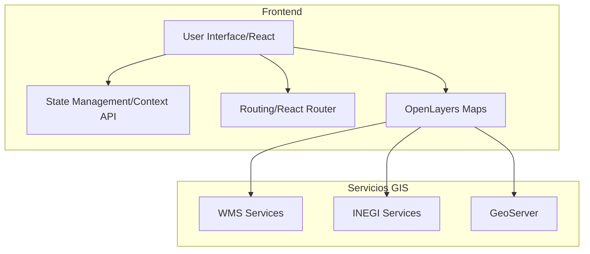

# MapaLab IIEG - Documentación de Arquitectura

## Tabla de Contenidos
- [Arquitectura del Sistema](#arquitectura-del-sistema)
  - [Diagrama de Arquitectura](#diagrama-de-arquitectura)
  - [Componentes Clave](#componentes-clave)
- [Componentes](#componentes)
  - [Capa Frontend](#capa-frontend)
  - [Capa de Integración](#capa-de-integración)
- [Stack Técnico](#stack-técnico)
- [Flujo de Datos](#flujo-de-datos)
- [Puntos de Integración](#puntos-de-integración)
- [Estructura del Proyecto](#estructura-del-proyecto)

## Arquitectura del Sistema
### Diagrama de Arquitectura


### Componentes Clave
- **Sistema de Mapas**
  - Visualización de capas
  - Gestión de basemaps
  - Interacción con servicios WMS

- **Gestión de Estado**
  - Contextos para mapas
  - Estado de capas y visualización
  - Integración con servicios GIS

## Componentes
### Capa Frontend
- **Componentes UI**
  - Componentes Base (`MapView`, `LayerControl`, `Download`)
  - Componentes de Navegación (`MapSider`, `LayerList`)
  - Componentes de Control (`BasemapSelector`, `LayerManager`)

- **Gestión de Estado**
  - `MapsContext`: Control de mapas y capas
  - `LayersContext`: Gestión de capas visibles

### Capa de Integración
- **Servicios**
  - Integración con WMS
  - Servicios de INEGI
  - GeoServer local

## Stack Técnico
### Frontend
- React + Vite
- OpenLayers
- TailwindCSS
- React Router

### Servicios
- GeoServer
- WMS Services
- INEGI Services

## Flujo de Datos
### Peticiones/Respuestas
1. Cliente solicita visualización de capa
2. Carga de servicios WMS/WMTS
3. Renderizado en el mapa
4. Actualización del estado de la aplicación

## Puntos de Integración
### Servicios GIS
- Servicios WMS de INEGI
- GeoServer local
- Servicios de mapas base (OSM, CARTO, ESRI)

## Estructura del Proyecto
```
mapalab-frontend/
├── src/
│   ├── components/
│   │   ├── maps/
│   │   │   ├── basemaps.js
│   │   │   ├── Download.jsx
│   │   │   ├── MapView.jsx
│   │   │   └── MapSider.jsx
│   ├── contexts/
│   │   └── MapsContext.js
│   ├── hooks/
│   │   └── useMaps.js
│   ├── pages/
│   │   └── Maps.jsx
│   ├── providers/
│   │   └── MapsProvider.jsx
│   └── utils/
│       └── map-utils.js