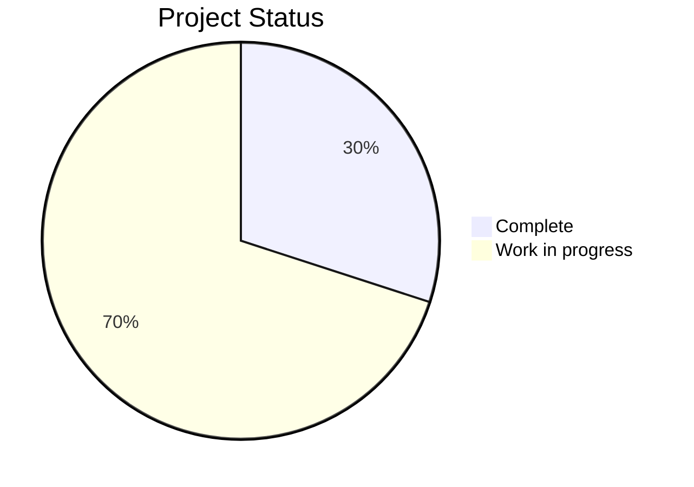

# FRONTEND MAPALAB
<div align="center">
    
</div>
<br>
<br>
<div align="center">


</div>

[[_TOC_]]

## 📖 Overview
MapaLab is a web application for creating, managing, and visualizing interactive maps using IIEG's geographic data. It provides tools for data analysis and cartographic visualization.

## 📦 Requirements
- Docker >= v28.2.2
- Docker compose >= v2.36.2
- node/npm >= v22.22.0(LTS)
- Git >= 2.48.1
- Web Browser (Firefox, Chrome, Brave, etc.)

## 🏁 Getting started
### Clone the repository
Clone the repository frontend and backend in the same folder.

```bash
git clone https://iieg-app.jalisco.gob.mx/iieg/mapalab-frontend.git
```

The file structure should be like this:
```
├── mapalab/
│   ├── frontend/          # Frontend React application
│   ├── backend/           # Backend API
│   └── nginx/             # Reverse proxy
```

It is necessary to modify and accommodate with the information required in the environment variables.
```bash
mv env.example .env
vi .env 
```

## 🗂️ Documentation
Documentation is available in the following sections:

- [Arquitectura del proyecto](./ARCHITECTURE.md)
- [Codigo de conducta](./CODE_OF_CONDUCT.md)
- [Contributing Guidelines](./CONTRIBUTING.md)
- [Changelog](./CHANGELOG.md)
- [Environment Variables](./.env.example)
- [Licencia](./LICENSE)

## 🩺 Project status


## 🧭 Roadmap
- [x] Basic map visualization - Q3 2025
- [x] Layer management - Q4 2025
- [ ] Data analysis tools - Q1 2026
- [ ] Advanced visualization features - Q2 2026

## 🖌️ Styling
This project uses [Tailwind CSS](https://tailwindcss.com/) for styling and [OpenLayers](https://openlayers.org/) for map rendering.

## 🖍️ Mockup
[MapaLab UI Design](https://xd.adobe.com/view/mapalab-design)

# Esquema Completo de z-index del Mapa

  ## Componentes de UI (Interfaz de Usuario)

  | z-index | Componente                    | Ubicación           | Descripción                                    |
  |---------|-------------------------------|---------------------|------------------------------------------------|
  | **50**  | FeatureInfoPanel              | Flotante            | Panel de información de features (más arriba)  |
  | **30**  | MeasurementConfigPanel        | Flotante            | Panel de configuración de mediciones           |
  | **30**  | LayerDetailModal              | Centro inferior     | Modal de detalle de capas                      |
  | **20**  | MapSider                      | Lateral izquierdo   | Menú lateral de capas                          |
  | **11**  | Barra de búsqueda             | Superior derecho    | Búsqueda y descarga                            |
  | **10**  | ActiveLayersList              | Superior derecho    | Lista de capas activas                         |
  | **10**  | SymbologyPanel                | Superior derecho    | Panel de simbología                            |
  | **10**  | ScaleLineControl              | Inferior centro     | Control de escala                              |
  | **10**  | MapControls                   | Inferior derecho    | Controles del mapa (zoom, ubicación, etc.)     |
  | **10**  | MeasurementControls           | Inferior izquierdo  | Herramientas de medición                       |

  ## Capas del Mapa (OpenLayers)

  ### Capas vectoriales y de dibujo
  | z-index  | Tipo de Capa                    | Descripción                                          |
  |----------|---------------------------------|------------------------------------------------------|
  | **1000** | Capas vectoriales (dibujo)      | Herramientas de medición, anotaciones, dibujos       |

  ### Capas temáticas WMS
  | z-index    | Tipo de Capa                  | Descripción                                          |
  |------------|-------------------------------|------------------------------------------------------|
  | **100-999**| Capas temáticas WMS           | Capas de datos (seguridad, salud, economía, etc.)    |

  ### Capas base del GeoServer (siempre visibles)

  | zIndex | Capa                    | Layer GeoServer         | Descripción                  |
  |--------|-------------------------|-------------------------|------------------------------|
  | **1**  | Curvas de nivel         | `curvas_de_nivel`       | Curvas de nivel (más abajo)  |
  | **2**  | Cuerpos de agua         | `cuerpos_de_agua_250k`  | Lagos, ríos                  |
  | **3**  | Límites municipales     | `limite_municipal`      | Límites municipales          |
  | **4**  | Caminos                 | `caminos_2012`          | Caminos                      |
  | **5**  | Cabeceras municipales   | `cabeceras_municipales` | Cabeceras municipales        |
  | **6**  | Aeropuertos             | `aeropuertos`           | Aeropuertos                  |
  | **7**  | Carreteras              | `carretera_2012`        | Atlas de carreteras          |
  | **8**  | Regiones                | `regiones`              | Regiones del estado          |

  ### Capas base dinámicas (según `base`)

  | zIndex | Capa                              | Layer GeoServer                  | Visible cuando   |
  |--------|-----------------------------------|----------------------------------|------------------|
  | **9**  | Límite estatal secundario IIEG    | `limite_estatal_secundario`      | `base = 'iieg'`  |
  | **10** | Límite estatal secundario INEGI   | `limite_estatal_inegi_secundario`| `base = 'inegi'` |
  | **11** | Límite estatal IIEG               | `limite_estatal`                 | `base = 'iieg'`  |
  | **12** | Límite estatal INEGI              | `limite_estatal_inegi`           | `base = 'inegi'` |

  ### Mapa base
  | z-index | Tipo de Capa                    | Descripción                                          |
  |---------|---------------------------------|------------------------------------------------------|
  | **-1**  | Mapa base (Carto/OSM)           | Fondo del mapa (Carto Light, Voyager, etc.)          |

  ## Diagrama Visual Completo

  ┌─────────────────────────────────────────────────────────────┐
  │  UI: FeatureInfoPanel                         [50]          │  ← Más arriba
  ├─────────────────────────────────────────────────────────────┤
  │  UI: MeasurementConfigPanel, LayerDetailModal [30]          │
  │  UI: MapSider                                 [20]          │
  │  UI: Barra de búsqueda                        [11]          │
  │  UI: Paneles y Controles                      [10]          │
  │      (ActiveLayersList, SymbologyPanel, MapControls, etc.)  │
  ├─────────────────────────────────────────────────────────────┤
  │  Capas vectoriales (dibujo)                   [1000+]       │  ← Herramientas de medición
  ├─────────────────────────────────────────────────────────────┤
  │  Capas temáticas (WMS)                        [100-999]     │  ← Seguridad, salud, etc.
  ├─────────────────────────────────────────────────────────────┤
  │  Límites estatales (IIEG/INEGI)               [11/12]       │  ← Dinámicos según base
  │  Límites estatales secundarios (IIEG/INEGI)   [9/10]        │  ← Dinámicos según base
  │  Regiones                                     [8]           │
  │  Carreteras                                   [7]           │
  │  Aeropuertos                                  [6]           │
  │  Cabeceras municipales                        [5]           │
  │  Caminos                                      [4]           │
  │  Límites municipales                          [3]           │
  │  Cuerpos de agua                              [2]           │
  │  Curvas de nivel                              [1]           │  ← Más abajo de capas base
  ├─────────────────────────────────────────────────────────────┤
  │  Mapa base (Carto/OSM)                        [-1]          │  ← Fondo
  └─────────────────────────────────────────────────────────────┘
